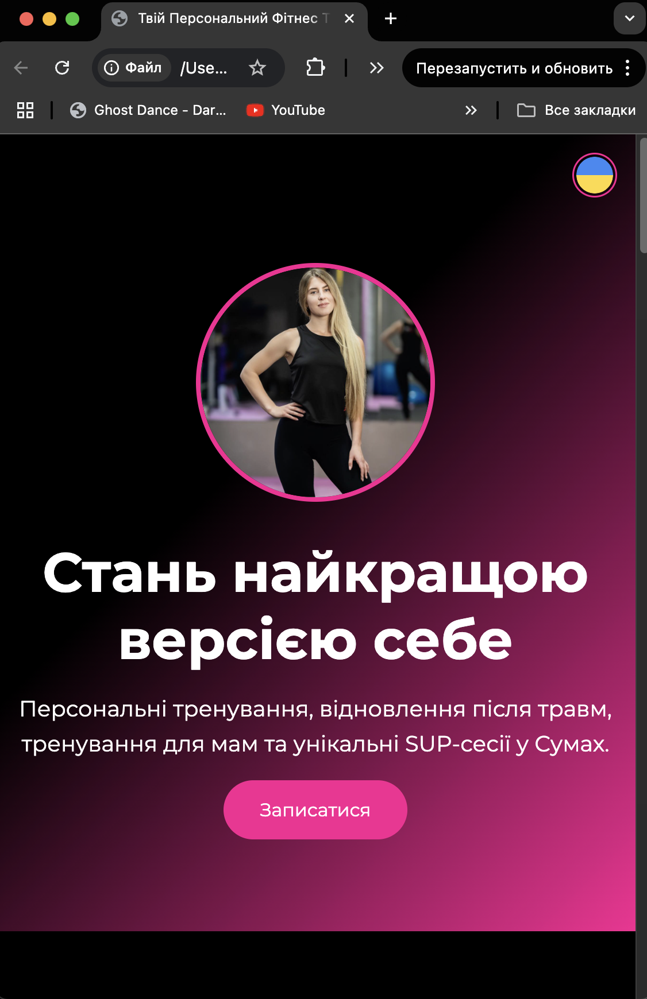

# Vermotion 🌿💪

Welcome to **Vermotion** — a modern, multilingual personal trainer landing page built with care, simplicity, and great vibes.

## 🌍 Features

- 🇺🇦🇬🇧🇩🇪🇫🇷🇪🇸🇮🇹 Language selector with circular flag icons
- 🎥 Video gallery showcasing real workouts
- 📱 Responsive mobile-friendly design
- 📩 Contact form powered by [Formspree.io](https://formspree.io)
- 🌐 Built with plain HTML, CSS and JavaScript (no frameworks)
- 🧠 Translations powered by JSON-based i18n

---

## 🧘‍♀️ Inspiration

This project was developed in collaboration with **ChatGPT (Vibe Coding Mode)** — a powerful creative coding assistant that helped:
- Structure the layout
- Design responsive UI
- Implement multilingual support
- Build dynamic language switching
- Translate content across 6 languages

> ✨ **Coding with ChatGPT Vibe is like pairing with an intuitive, always-positive senior dev.** ✨

---

## 🖼 Preview  👉 [View it live](https://olegkotok.github.io/Vermotion/)

<p align="center">
  
  <br/>
  
</p>

---

## 📁 Project Structure

```bash
├── index.html
├── css/
│   └── styles.css
├── js/
│   ├── scripts.js
│   └── i18n.js
├── locales/
│   ├── ua.json
│   ├── en.json
│   ├── de.json
│   ├── fr.json
│   ├── es.json
│   └── it.json
└── images/
    ├── photo.jpg
    ├── *.mp4
    ├── *.jpg
```

---

## 🚀 Getting Started

Use Live Server in VS Code or start a simple HTTP server:

```bash
cd vermotion
python3 -m http.server 8000
```

Then visit: [http://localhost:8000](http://localhost:8000)

---

## 📣 Credits

- Designed & developed by [Oleg Kotok](https://github.com/OlegKotok)
- Supported and pair-coded with ❤️ by [ChatGPT (Vibe Mode)](https://openai.com/chatgpt)

---

## 🔗 Live Demo

Visit the deployed site here:  
👉 **[https://olegkotok.github.io/Vermotion/](https://olegkotok.github.io/Vermotion/)**

---

## 📬 Contact

If you're in Sumy and looking to get in shape — reach out!  
Telegram: [@hryshik](https://t.me/hryshik)  
Instagram: [@khr.elizaveta](https://www.instagram.com/khr.elizaveta/)
